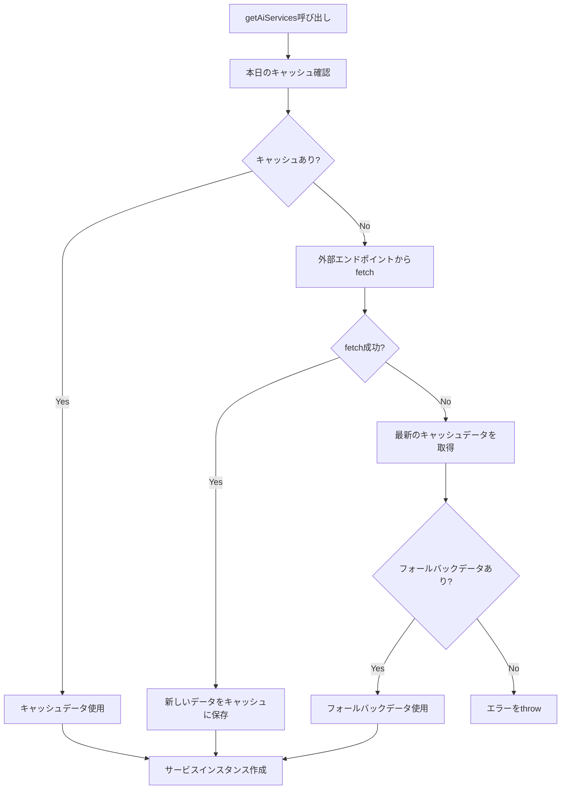

# AI Service Config Cache Design

## 概要

現在の `getAiServices` 関数が毎回外部エンドポイントから設定を fetch している問題を解決し、日付ベースのキャッシュ機能を追加して fetch 回数を最適化する。

## 現在の課題

- `src/services/aiService/index.ts` の `getAiServices` 関数で毎回 `import.meta.env.WXT_CONFIG_ENDPOINT` から設定を fetch している
- ネットワーク負荷とレスポンス時間の増加
- fetch失敗時のフォールバック機能が存在しない

## 要件

1. **日付ベースキャッシュ**: 本日の日付のデータがあれば fetch をスキップ
2. **自動キャッシュ更新**: fetch 成功時に拡張機能のStorageに自動保存
3. **フォールバック機能**: fetch 失敗時は前日以前のキャッシュデータを使用
4. **既存パターンとの整合性**: WXT Storage API と既存のファサードパターンを維持

## アーキテクチャ設計

### データ構造

```typescript
interface AiConfigCacheData {
  date: string        // YYYY-MM-DD format
  configs: any        // AI service configurations
  cachedAt: number    // Unix timestamp
}
```

### ファイル構成

```
src/services/storage/
├── aiConfigCache.ts         # 新規: AIコンフィグキャッシュサービス
├── definitions.ts           # 更新: キャッシュストレージ定義追加
├── index.ts                 # 更新: ファサードにキャッシュ機能追加
└── __tests__/
    └── aiConfigCache.test.ts # 新規: テストファイル
```

### 実装詳細

#### 1. ストレージ定義 (`definitions.ts`)

```typescript
export const aiConfigCacheStorage = storage.defineItem<AiConfigCacheData | null>(
  "local:aiConfigCache",
  {
    fallback: null,
    version: 1,
    migrations: {},
  },
)
```

#### 2. キャッシュサービス (`aiConfigCache.ts`)

主要メソッド:
- `getTodaysCache()`: 本日のキャッシュデータ取得
- `saveCache(configs)`: 設定データをキャッシュに保存
- `getLatestCache()`: 最新のキャッシュデータ取得（フォールバック用）
- `isToday(dateString)`: 日付が今日かどうか判定

#### 3. ストレージファサード (`index.ts`)

`StorageService` クラスに以下メソッドを追加:
- `getTodaysAiConfigCache()`
- `saveAiConfigCache(configs)`
- `getLatestAiConfigCache()`

#### 4. `getAiServices` 関数の修正

```typescript
export const getAiServices = async () => {
  const storage = StorageService.getInstance()

  // 1. 本日のキャッシュをチェック
  const todaysCache = await storage.getTodaysAiConfigCache()
  if (todaysCache) {
    console.debug("Using cached AI service configs:", todaysCache)
    return createServices(todaysCache)
  }

  // 2. キャッシュがない場合、fetch実行
  try {
    const configs = await fetch(import.meta.env.WXT_CONFIG_ENDPOINT).then((res) =>
      res.json(),
    )
    console.debug("Fetched AI service configs:", configs)

    // 3. fetch成功時にキャッシュに保存
    await storage.saveAiConfigCache(configs)

    return createServices(configs)
  } catch (error) {
    console.error("Failed to fetch AI service configs:", error)

    // 4. fetch失敗時はフォールバックを使用
    const fallbackCache = await storage.getLatestAiConfigCache()
    if (fallbackCache) {
      console.warn("Using fallback AI service configs:", fallbackCache)
      return createServices(fallbackCache)
    }

    throw new Error("No AI service configs available")
  }
}
```

## データフロー



## テスト戦略

### TDD アプローチ

1. **Unit Tests**: 各サービスメソッドの単体テスト
2. **Integration Tests**: キャッシュフローの統合テスト
3. **Edge Case Tests**: ネットワークエラー、データ不正などの例外処理

### テストケース

#### aiConfigCache.ts
- 本日のキャッシュが正しく取得できる
- キャッシュ保存が正常に動作する
- 日付判定が正確に行われる
- 最新キャッシュの取得が動作する

#### getAiServices 統合テスト
- キャッシュヒット時のフロー
- キャッシュミス -> fetch成功のフロー
- fetch失敗 -> フォールバック使用のフロー
- 全てのデータが存在しない場合のエラーハンドリング

## パフォーマンス向上効果

- **ネットワーク負荷軽減**: 日次1回のみfetchに削減
- **レスポンス時間改善**: ローカルキャッシュからの即座読み込み
- **オフライン対応**: ネットワークエラー時のフォールバック機能

## 実装順序

1. 設計書の作成 ✅
2. aiConfigCache サービスのテスト作成
3. aiConfigCache サービスの実装
4. ストレージ定義の更新
5. ストレージファサードの拡張
6. getAiServices 関数のリファクタリング
7. 統合テストの作成と実行